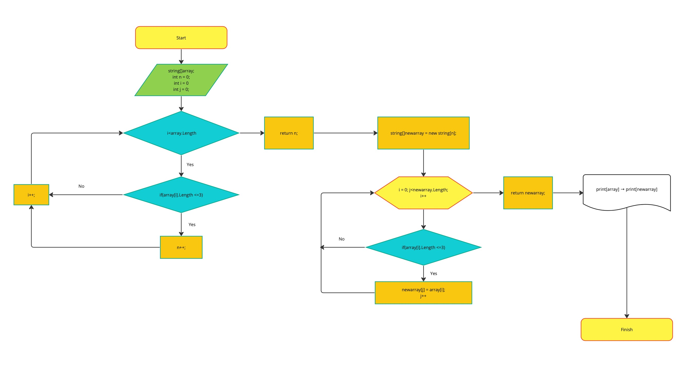

# Контрольная работа по первому блоку
___
___Дана задача следующего содержания:___

> Написать программу, которая из имеющегося массива строк формирует новый массив из строк, длина которых меньше, либо равна 3 символам. Первоначальный массив можно ввести с клавиатуры, либо задать на старте выполнения алгоритма. При решении не рекомендуется пользоваться коллекциями, лучше обойтись исключительно массивами.
Примеры:
[“Hello”, “2”, “world”, “:-)”] → [“2”, “:-)”]
[“1234”, “1567”, “-2”, “computer science”] → [“-2”]
[“Russia”, “Denmark”, “Kazan”] → []

___При решении этой задачи нам поможет создание блок-схемы алгоритма:___


Для решения задачи нам потребуется реализовать следующие этапы:

### 1. Ввести изначальный массив. 
Для этого у нас есть 2 опции:
* задать массив изначально в коде;	
* попросить пользователя ввести массив с клавиатуры.

Попробуем реализовать *второй* сценарий. Для этого нам потребуется:
* попросить пользователя ввести размер массива;
* убедиться, что размер массива является натуральным числом, в противном случае повторить запрос размера массива;
* запросить элементы массива.

__Эта часть будет реализована с помошью следующего кода:__

```
System.Console.WriteLine("Пожалуйста, введите размер массива:");
int size = Convert.ToInt32(System.Console.ReadLine());

while (size <= 0)           
{
    if (size <= 0)
    {
        System.Console.WriteLine("Ошибка! Введите натуральное число!");
    }
    size = Convert.ToInt32(System.Console.ReadLine());
}

string[] CreateStringArrayFromConsole(int size)     
{
    int i = 0;
    string[] array = new string[size];
    while (i < size)
    {
        System.Console.WriteLine($"Введите элемент массива под индексом {i}:");
        array[i] = System.Console.ReadLine();
        i++;
    }
    return array;
}

string[] array = CreateStringArrayFromConsole(size);  
```

### 2. Найти размер результирующего массива.
Так как в задаче требуется вывести результат именно в виде нового массива, необходимо сначала определить его ***размер***. В этих целях необходимо создать ___цикл___, который будет считать количество элементов исходного массива, удовлетворяющих условию (содержат не более 3 символов).

__Эта часть будет реализована с помошью следующего кода:__
```
int CountItems(string[] array)      
{
    int n = 0;
    int i = 0;
    while (i < array.Length)
    {
        if (array[i].Length <= 3)
        {
            n++;
            i++;
        }
        else i++;
    }
    return n;
}
```


### 3. Теперь можем создать итоговый массив.
Его размер был вычислен в предыдущем пункте. Для заполнения массива элементами потребуется ___цикл___, который будет брать из начального массива элементы, удовлетворяющие условию задачи:
```
string[] CreateResultingArray(string[] array, int size)     
{
    string[] newarray = new string[size];
    int i = 0;
    int j = 0;
    while (i < array.Length)
    {
        if (array[i].Length <= 3)
        {
            newarray[j] = array[i];
            j++;
            i++;
        }
        else i++;
    }
    return newarray;
}

string[] newarray = CreateResultingArray(array, CountItems(array));
```

### 4. Далее нужно ввести метод для вывода массива.
Для получения результата, как в приведённом примере, необходимо, чтобы массив был обрамлён квадратными скобками, а каждый элемент находился в кавычках и был отделён от другого элемента запятой. Стоит предусмотреть *отдельное условие* для вывода только квадратных скобок, если *размер массива равен 0*.

```
void PrintArray(string[] array)     
{
    if (array.Length == 0)
    {
        System.Console.Write("[]");
    }
    else
    {					
	int i = 0;
    	System.Console.Write("[");
        while (i < array.Length - 1)
    	{
            System.Console.Write('"' + array[i] + '"' + ',' + ' ');
            i++;
        }
        System.Console.Write('"' + array[array.Length - 1] + '"' + "]");
    }
}
```

### 5. Вывод результата работы программы.
На финише работы программа должна вывести оба массива, разделённых стрелкой «**→**», однако так как этого символа не нашлось в юникоде (UTF-8), то заменим на сочетание символов «**->**».

```
PrintArray(array);                  
System.Console.Write("->");        
PrintArray(newarray);   
```
